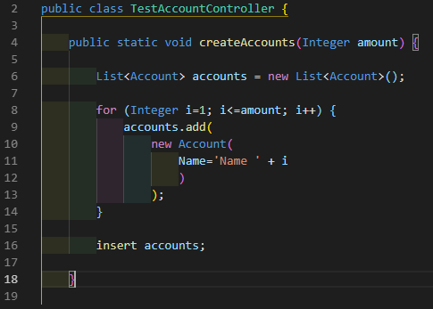

# README

## Salesforce VSCode Extensions to complete Official Salesforce Extension Pack

This is an unofficial pack of VSCode extensions that IMHO will help Salesforce Developer Teams write better code.

### Extensions included

#### Apex. Code foramt and deployment

-   [ForceCode by JohnAaronNelson](https://marketplace.visualstudio.com/items?itemName=JohnAaronNelson.ForceCode)
    Will help to handle apex and triggers in a fastest way than SFDX deploy commands do.
-   [Uncrustify by Laurent Tréguier](https://marketplace.visualstudio.com/items?itemName=LaurentTreguier.uncrustify)
    Formatting Apex. Consider use [my uncrustify cfg file](files/uncrustify.cfg).
    -   Indentation with tabs instead spaces, this will save space over custom code limit.
    -   Indent body class
    -   Autoformat comments
    -   White spaces around +-\*= etc.
    -   And more...

#### Formatting: Aura, Lightning and Visualforce

-   [Prettier - Code formatter by Esben Petersen](https://marketplace.visualstudio.com/items?itemName=esbenp.prettier-vscode)
    Formatting html, JS and CSS, Visualforce, Aura and Lightning Web Components. There is ongoing work to be adopted by Salesforce DX VSCode Extension. [See the roadmap](https://github.com/forcedotcom/salesforcedx-vscode/wiki/Roadmap)
-   [indent-rainbow by oderwat](https://marketplace.visualstudio.com/items?itemName=oderwat.indent-rainbow)
    Helpful when you have complex code and you want to read or improve it.
-   [Bracket Pair Colorizer](https://marketplace.visualstudio.com/items?itemName=CoenraadS.bracket-pair-colorizer)
    Some pieces of code may be simply horrible to find the right brace o bracket.

#### Productivity

-   [JavaScript (ES6) code snippets by charalampos karypidis](https://marketplace.visualstudio.com/items?itemName=xabikos.JavaScriptSnippets)
    Javascript snippets, useful for Aura and Lightning
-   [Turbo Console log by ChakrounAnas](https://marketplace.visualstudio.com/items?itemName=ChakrounAnas.turbo-console-log)
    Provide a kindly way to write debug messages to Javascript console
-   [Auto-Open Markdown Preview by hnw](https://marketplace.visualstudio.com/items?itemName=hnw.vscode-auto-open-markdown-preview)
    Helps to write markdown documents, I swear.

#### Team work

-   [Gitlens by Eric Amodio](https://marketplace.visualstudio.com/items?itemName=eamodio.gitlens)
    An essential extension for team work.

My VSCode related settings

```
{
	"prettier.singleQuote": true,
	"prettier.useTabs": true,
	"editor.tabSize": 4,
	"editor.formatOnSave": true,
	"editor.insertSpaces": false,
	"editor.detectIndentation": false,
	"uncrustify.langOverrides": {
		"apex": "JAVA",
		"apex-anon": "JAVA"
	},

	"[html]": {
		"editor.defaultFormatter": "esbenp.prettier-vscode"
	}
}
```

Rainbow indent and Backet Pair working together with tab indentation:



Extensions NOT included

-   Salesforce Extension Pack

**Enjoy!**
